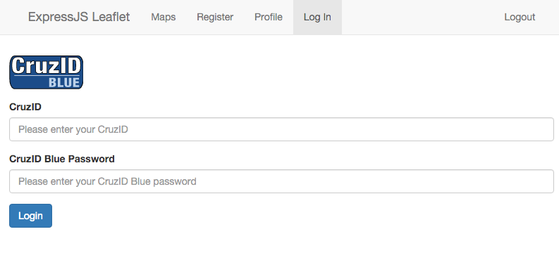
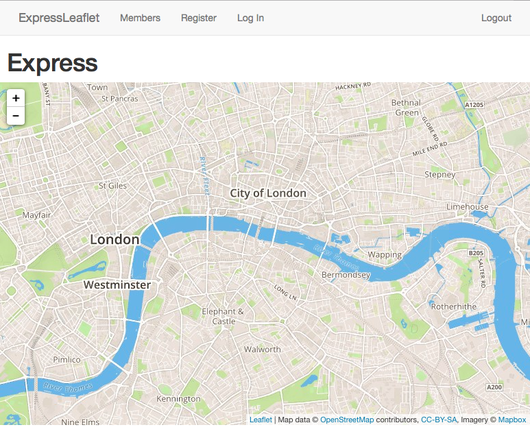

# nodejs-leaflet ldapauth branch

In October 2015, to make it more useful, I changed the local authentication to use our LDAP and CruzID Blue process. Upon successful authentication, we drop the authenticated user on a "profile" page that outputs their LDAP object info.

More background is in the README of the master branch of this project.

# Requirements
You'll need SSL setup on your dev environment. You'll find in bin/www that we're convigured to use a cert and key on my workstation. Edit as necessary for you're local config.

The mapbox library and token is for a version of my styled mobile map. Displays the standard map using OSM data that is themed for UC Santa Cruz. More about the Mapbox theming is found at http://petermcmillan.com/

The real secret to getting 100% height and width via Bootstrap 3 was to restructure the divs and classes a little and add some specific CSS overwrites to handle default padding and margins found in Bootstrap 3.

Start the app with ```npm start``` at the command line. Find your page at ```https://localhost:3000```. Note that we're not doing any redirection of http to https; that's for another more fully fleshed out project.

Here's a screen shot of a CruzID Blue login that authenticates against the ADC CruzID Blue LDAP server.



Here's a shot of the apps main page.




```
<div class="container-fluid">
	<h1>ExpressJS Leaflet</h1>
		<div class="row">
			<div id="map"></div>
		</div>
</div>
```

The CSS secret is found in stackoverflow and Leaflet Tips book.

```
html, body, #map
{
    width: 100%;
    height: 100%;
    overflow: hidden;
}

body {
  padding-top: 50px;
}

.container-fluid {
  height: 100%;
  width: 100%;
}

.row {
  margin-right: -15px;
  margin-left: -15px;
  height: 100%;
}
```

# Starting Up
```node ./bin/www```

In the bin/www file you'll see the configuration for getting the https server configured. 

# Getting Started
You'll need to clone the repo and run ```npm install``` to pull down the node modules. You'll also need to run ```mkdir -p data/db``` to create a mongo directory. 

Run ```sudo mongod --dbpath=data/db``` to kick off the Mongo daemon. 

Click the Register link. This presents a set of fields that most apps would collect for a user profile. You'll be writing the username and password to a local db which would be useful if you were doing a local authentication strategy.

Once registered, you can login. This will attempt to use the LDAP PassportJS strategy to connect to (CRM LDAP for testing).

# Dependencies 
In rebuilding this prototype, I came across a few issues that we need to note here.

First, you need to generate a SSL key/cert pair to put the app into SSL.

Second, you can't authenticate against CRM LDAP from Eduroam (or at least from https://localhost:3000/login - might need vetting). I had consistent success via a VPN based IP address.

Third, you need to have a local DB. Why? Because the basic code comes from a Udemy Eduonix nodejs class. The chapter was on local auth which I then adapted for LDAP Auth.

Fourth, I had to spend some time messing with the PassportJS LDAP strategy. We do not send bindDN since we want to authenticate the provided username. passport-ldapauth uses examples that call for the use of '{{}}' around both password and username fields. I finally got this working by removing the braces around password and using them around username. weird.


# Authentication
The secret here was setting the bindDN to '' and then querying the ldap server. We run this all via SSL, so that entailed setting up ldap.conf to point to our CRM LDAP and issuing a valid InCommon cert for my development workstation. 

So the basics are that the login form posts our username and password. The passport-ldapauth strategy does a passport.authenticate call. If the we don't fail with a 401 unauthorized error, we are authenticated via the LDAP bind process for the users uid that was passed in.

There's the differences in connection type between HTTP and LDAP to be aware of as well as the nomenclature of bind and authenticate; LDAP uses different definitions for these terms that you have to learn.

# References
I found these links were helpful in getting a better understanding of PassporJS flow.
http://toon.io/understanding-passportjs-authentication-flow/

This article, http://www.ibm.com/developerworks/library/se-use-ldap-authentication-authorization-node.js-bluemix-application/index.html is good if we wanted to hand code the interaction for the LDAP bind and password check. It also has code on sessions management.

# User Object LDAP Data
```
{  
   "dn":"uid=peterm,ou=People,dc=crm,dc=ucsc,dc=edu",
   "controls":[  

   ],
   "givenName":"Peter",
   "homeDirectory":"/afs/cats.ucsc.edu/users/y/peterm",
   "loginShell":"/bin/bash",
   "mail":"peterm@ucsc.edu",
   "sambaSID":"S-1-5-21-XXXXXXXXXX-XXXXXXXXXX-XXXXXXXXXX",
   "ucscPersonGuID":"G000108642",
   "uid":"peterm",
   "uidNumber":"13403",
   "ucscPersonGivenName":"Peter",
   "gidNumber":"100000",
   "sn":"McMillan",
   "ucscPersonSn":"McMillan",
   "ucscPersonMail":"peterm@ucsc.edu",
   "ucscPersonPubDivision":[  
      "Information Technology Services",
      "Business & Administrative Services",
      "Chancellor's Office/EVC"
   ],
   "ucscPersonPubPhoneticGivenName":"Peter",
   "ucscPersonPubOfficeHours":"M-F 8-5",
   "ucscPersonPubPhoneticSn":"McMillan",
   "ucscPersonPubMailStop":"Chancellor's Office",
   "cn":[  
      "Peter McMillan",
      "Peter S Mc Millan"
   ],
   "ucscPersonPubDepartmentNumber":"Information Technology Services",
   "ucscPersonPubTitle":[  
      "Director, Client Relationship Management",
      "Divisional Liaison for all administrative divisions"
   ],
   "ucscPersonPubRoomNumber":"273 Kerr Hall",
   "ucscPersonPubStreet":"273 Kerr Hall",
   "ucscPersonPubL":"Santa Cruz",
   "ucscPersonPubSt":"CA",
   "ucscPersonPubPostalCode":"95064",
   "ucscPersonTelephoneNumber":"831-459-5830",
   "objectClass":[  
      "ucscPerson",
      "top",
      "eduPerson",
      "inetOrgPerson",
      "sambaSamAccount",
      "posixAccount",
      "organizationalPerson",
      "person",
      "ucscMain"
   ]
}
```


